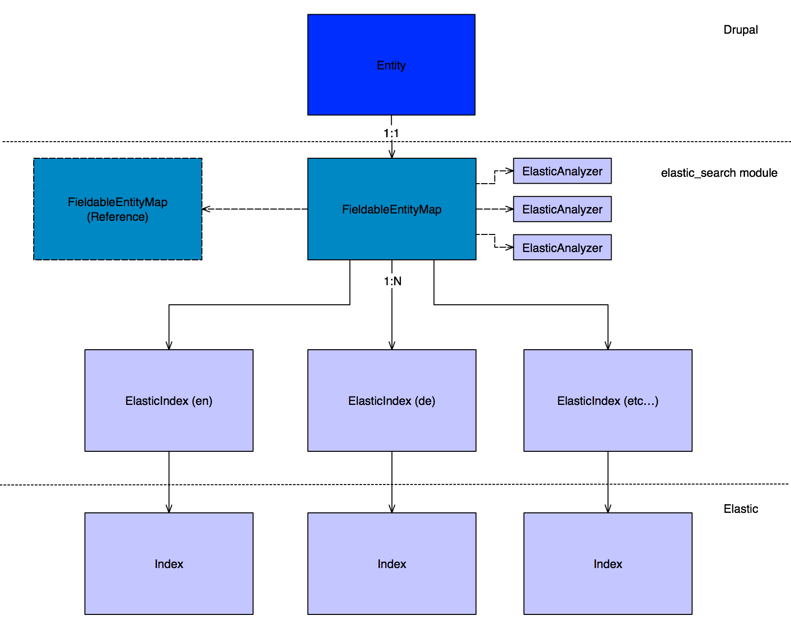

# Developers Guide

## Local Development Environment

If you have docker set up then development is very simple. (If you use OSX we would advise using [DM](https://github.com/twhiston/dm) to set up your local environment with faster NFS shares and XDebug config for docker and phpstorm)
The /dev folder of the module contains a full working development environment which is analogous to the environment run by the CI when tests are execute on a GitHub pull request.

`docker-compose up`
This will start up an ephemeral drupal install where the site, database and elastic data are stored only in the container. To persist data look at the docker-compose.yml file and the commented out lines in relation to this.

The username and pass for the admin user can be set via the docker-compose.yml file using the environmental variables `DRUPAL_ACCOUNT_NAME` and `DRUPAL_ACCOUNT_PASS`
See the docker hub details for how to change passwords for other images

| Service        | User    | Pass     |
|:---------------|:--------|:---------|
| Drupal         | admin   | changeme |
| Elastic/Kibana | elastic | changeme |
| mariadb        | dbuser  | dbpass   |


The current entrypoint is `/opt/app-root/scripts/debug.sh`. This script is provided by the drupal_module_tester container and by default performs the following actions every time it is started:

1. Links your local module code to the container as a volume
2. Runs `composer install` in your module root
3. Tries to install drupal 8 (if already installed due to active db container this will simply output an error and continue)
4. Tries to install your module (if already installed will output an error and continue)
5. Installs the seven theme and sets it as default (for a nicer development experience compared to the ci build)
6. Installs a default config to link to the local elastic instance

To skip steps 2-5 add the following configuration to your docker-compose.yml file
```
environment:
      - BOOTSTRAP=false
```
Be aware however that if you destroy the container you will need to set this to true for the first container start so that drupal is correctly installed.

To skip step 5 add the following configuration to your docker-compose.yml file
```
environment:
    - DEFAULT_CONFIG=false
```

To reinstall drupal and your module simply `docker-compose down && docker-compose up`

## Entity Relation Overview

The elastic_search plugin introduces a number of entities that are used to compose the final index output for Elastic.
This structure is inherently recursive as a fieldable entity map can refer to another entity type, which in turn must have a fieldable entity map.
As this can be painful due to the need to create users, paragraphs, node types etc... maps, the plugin offers the map generation feature. Read more about this in the user guide
TODO - Add link

Drupal Entity types have a 1:1 relationship to a FieldableEntityMap, which describes how each of its fields are mapped in elasticsearch. This mapping many optionally contain references to other drupal entity types, which will be either a simple reference (id) or inline mapping depending on settings.
FieldableEntityMaps have a 1:N relationship with ElasticIndex entities. This is because in multilingual environments to take advantage of elastic's language analyzers we need to seperate documents by language, which requires seperate indices.
ElasticIndex entities have a 1:1 relationship with Indices on an elastic search server.

The structure is described below.



Currently the only supported analyzers are the ones inbuilt in elastic search as custom analyzer generation is not yet supported in the Cartographer class.